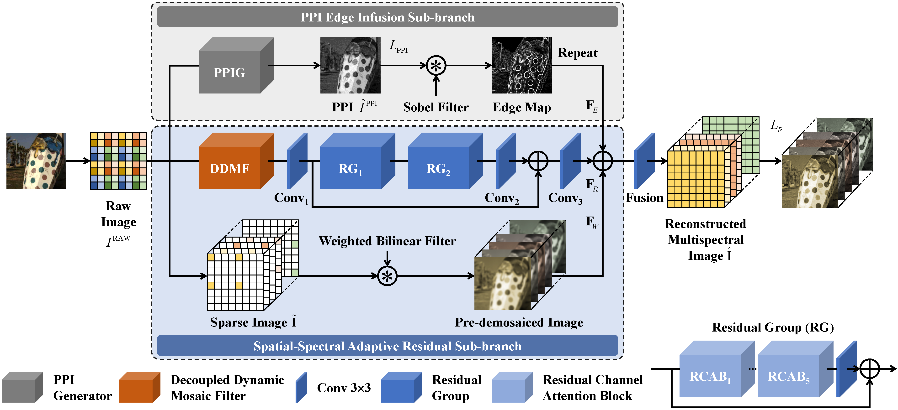
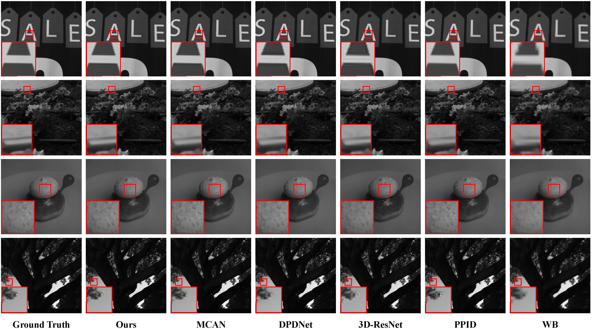

# PPI Edge Infused Spatial–Spectral Adaptive Residual Network

This repo is the official implementation of the following paper:

"PPI Edge Infused Spatial–Spectral Adaptive Residual Network for Multispectral Filter Array Image Demosaicing" (TGRS 2023) [[Paper](https://ieeexplore.ieee.org/abstract/document/10188849)].

## Introduction

We present a pseudo-panchromatic image (PPI) edge-infused spatial–spectral adaptive residual network (PPIE-SSARN) for MSFA image demosaicing. 



The proposed two-branch model deploys a residual subbranch to adaptively compensate for the spatial and spectral differences of reconstructed multispectral images and a PPI edge infusion subbranch to enrich the edge-related information. Moreover, we design an effective mosaic initial feature extraction module with a spatial- and spectral-adaptive weight-sharing strategy whose kernel weights can change adaptively with spatial locations and spectral bands to avoid artifacts and aliasing problems.

## Datasets

- ARAD-1K Dataset
  	Training [[Baidu]()] (Code: arad)
  	Testing   [[Baidu](https://pan.baidu.com/s/1u7theJAXvZ-zMcNgFRh1yA)] (Code: arad) / [[Google](https://drive.google.com/file/d/1lj87dO2g1zdKBnlBKNPFiEaeDwhZq_Zv/view?usp=drive_link)]

- Chikusei Dataset
  	Training [[Baidu](https://pan.baidu.com/s/1o7mQrzij1nJj4Ad3qYHR5w)] (Code: chik) / [[Google](https://drive.google.com/file/d/1HKiY9Zvl6uYvDNM0WxGEAPercTpxEgOv/view?usp=drive_link)]
  	Testing   [[Baidu](https://pan.baidu.com/s/1qAv0gQI0AP2ukYSsfF2IxQ)] (Code: chik) / [[Google](https://drive.google.com/file/d/1A_lp1k_IpZRDC6s2kyjIOWzbn_JAiaF-/view?usp=drive_link)]

## Install

- Clone this repo:

  ```
  git clone https://github.com/bowenzhao-zju/PPIE-SSARN
  cd PPIE-SSARN
  ```

- Build the DDMF module:

  ```python
  cd ddmf
  python setup.py install
  mv build/lib*/* .
  ```

## Train

- Set the data path and the hyperparameters for training in `config.py`.

- Run `train.py`:

  ```python
  python train.py
  ```

## Test

- Set the data path and the weight file (`*.pth`) path for testing in `config.py`.

- Run `test.py`:

  ```python
  python test.py
  ```

## Results



Visual comparisons for demosaicing results on the ARAD-1K dataset. Our method is compared with five alternatives, that is, MCAN [[Code](https://github.com/polwork/Mosaic-Convolution-Attention-Network-for-Demosaicing-Multispectral-Filter-Array-Images)], DPDNet [[Code](https://github.com/liushumin/DDM-Net)], 3D-ResNet, PPID [[Code](https://ieeexplore.ieee.org/ielx7/6745852/8098624/7893771/tci-mihoubi-2691553-mm.zip?arnumber=7893771)], and WB. The first column shows the GT. In addition, zoomed-in views of selected regions are provided. Please zoom in to see the details.

## Citation

If you find the code and datasets helpful in your research work, please cite the following paper:

```
@ARTICLE{10188849,
  author={Zhao, Bowen and Zheng, Jiesi and Dong, Yafei and Shen, Ning and Yang, Jiangxin and Cao, Yanlong and Cao, Yanpeng},
  journal={IEEE Transactions on Geoscience and Remote Sensing}, 
  title={PPI Edge Infused Spatial–Spectral Adaptive Residual Network for Multispectral Filter Array Image Demosaicing}, 
  year={2023},
  volume={61},
  number={},
  pages={1-14},
  doi={10.1109/TGRS.2023.3297250}}
```
